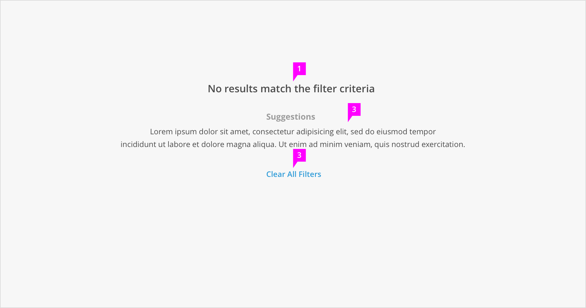
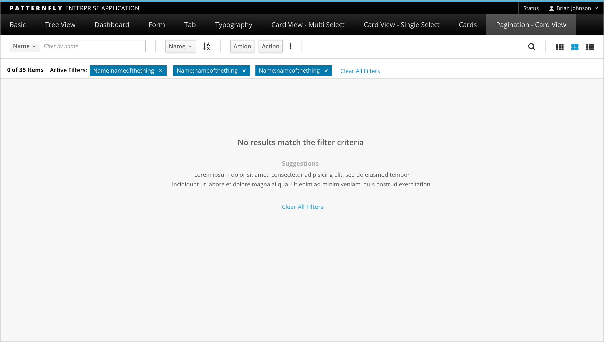
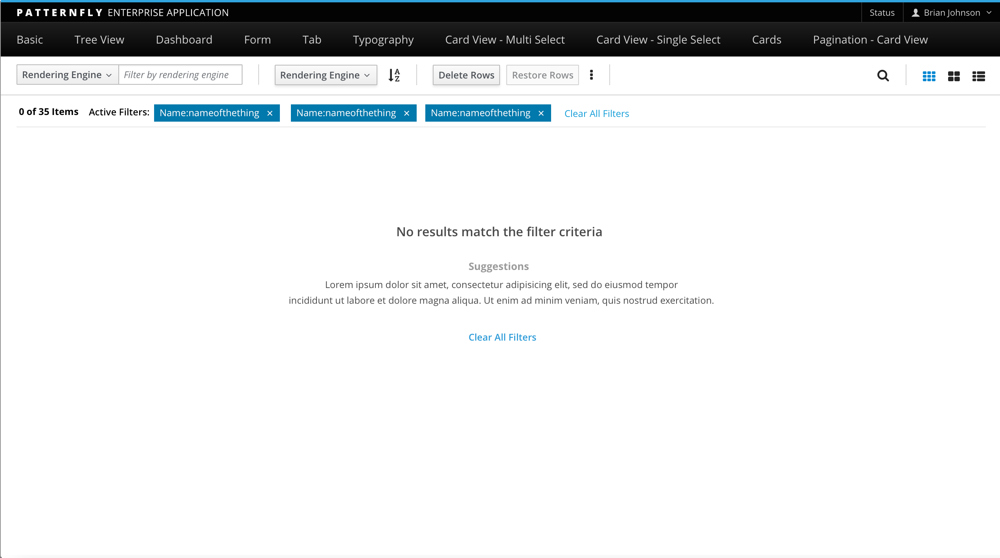

# Filter

## Filter Trigger
The filter trigger is a component that adds active filters to a page. It is located on the left side of the page, often within the [toolbar](http://www.patternfly.org/pattern-library/forms-and-controls/toolbar/). A filter trigger may be a simple text box or something much more complicated. Only one type of filter trigger should be used on a given page.
Possible filter triggers include:
- [Textbox filter](http://www.patternfly.org/pattern-library/forms-and-controls/textbox-filter/)
- [Checkbox filter](http://www.patternfly.org/pattern-library/forms-and-controls/checkbox-filter/)

## Active Filters Bar

1. **Filter Chips**: Filters are labeled with the attribute and value used to create them. Clicking the X in the chip will remove the filter. New filters appear to the right of existing filters. If no active filters exist, the active filters bar may be hidden.
1. **Grouped Filter Chips** (optional): In some cases, filters may have more than one value for a given attribute. When this happens, the values are shown grouped together . They may be removed separately by clicking on their respective Xs.
1. **Clear All Filters**: Clicking this action removes all currently active filters.
1. **Items Count**: The number of items that match the currently active filters and the number of total items in the view should be displayed next to the active filters. If there are no active filters, only the total number of items should be shown. The term “Items” should be used as a default label unless there is a more descriptive label that can be applied to the objects on the page (e.g. “28 cars”)
1. **Inline Active Filters** (optional): If filtering is used without any of the other elements of the [toolbar](http://www.patternfly.org/pattern-library/forms-and-controls/toolbar/), active filters can be displayed inline to save vertical space

## Filter Behavior

1. Filters between attribute categories should be combined with a boolean AND operator
  - **Example** an item must be both a car AND blue to be shown in the list of results
1. Filters within a category are shown grouped together and should be combined with a boolean OR operator
  - **Example** Items can be blue OR green and still be shown in the list of results
1. If the list is not otherwise sorted, items that satisfy a higher number of filters should be shown higher up the page.
  - **Example** Items that are blue as well as green are listed before items that are only blue or only green.

## Displaying a Null Result Set
If the current set of active filters returns 0 results, an empty state message will appear within the current view.

1. **Message**: Alert user that there are 0 results based on the filter criteria
1. **Suggestions**: A brief message suggesting how to fix the problem.
1. **Clear All Filters**: Clicking this will clear all applied filters and restore content to this view.
1. **Background**: The background color of this form will match the color of the current view. Note that in [Table View](http://www.patternfly.org/pattern-library/content-views/table-view/), the background color is white.

This message will always be displayed within the current view and the Toolbar will remain active so that the user can modify filter criteria.

Null Result Set in [Card](http://www.patternfly.org/pattern-library/content-views/card-view/) or [List View](http://www.patternfly.org/pattern-library/content-views/list-view/)

Null Results in [Table View](http://www.patternfly.org/pattern-library/content-views/table-view/)

